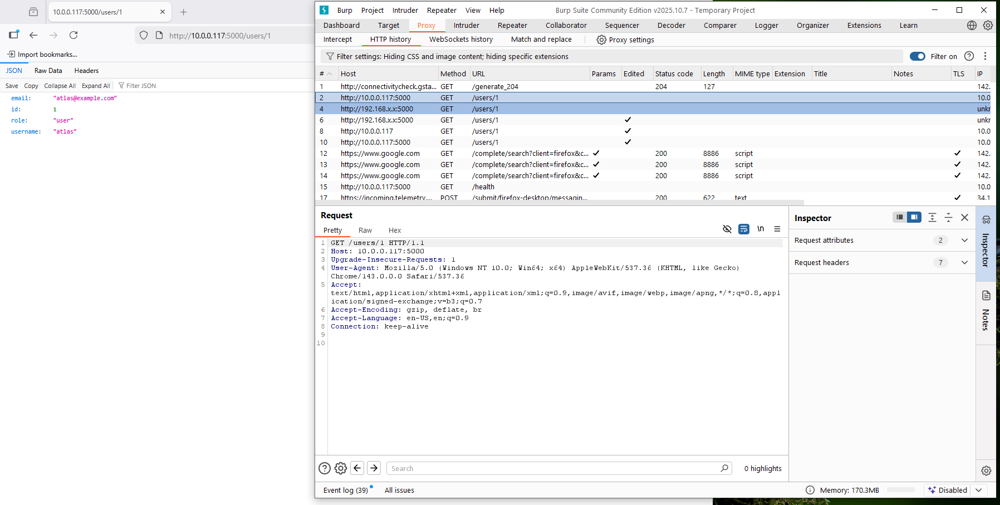
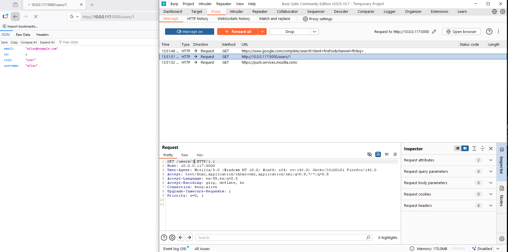
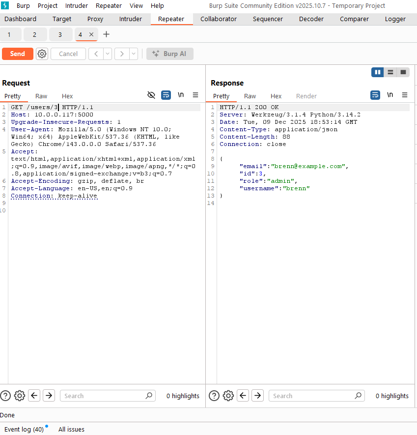
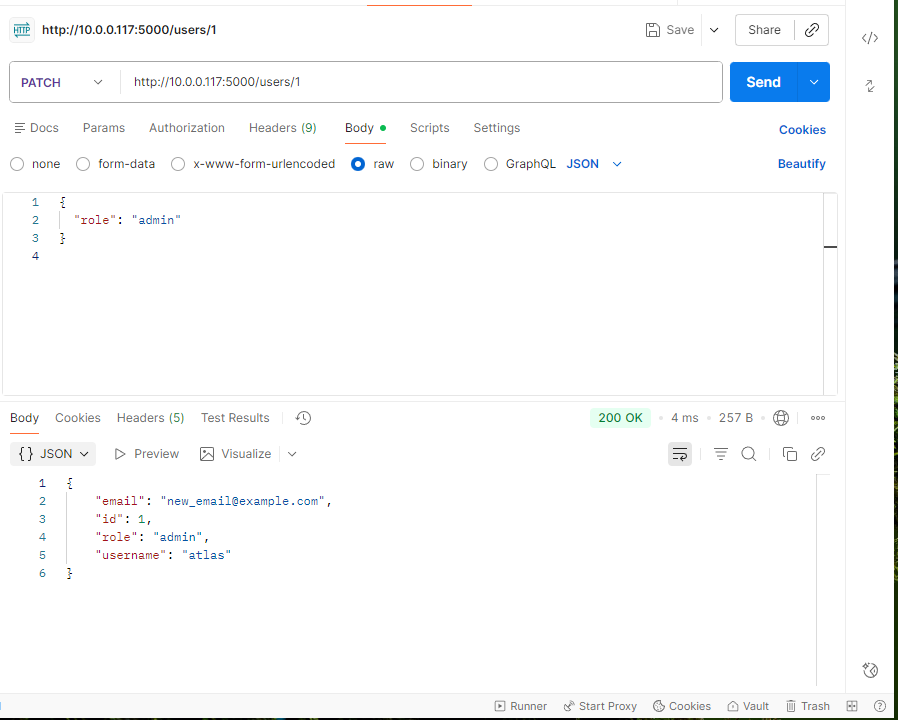
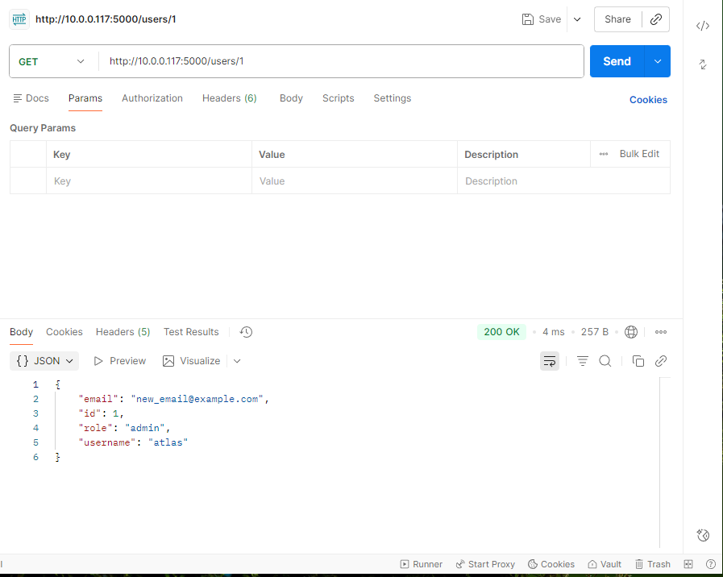
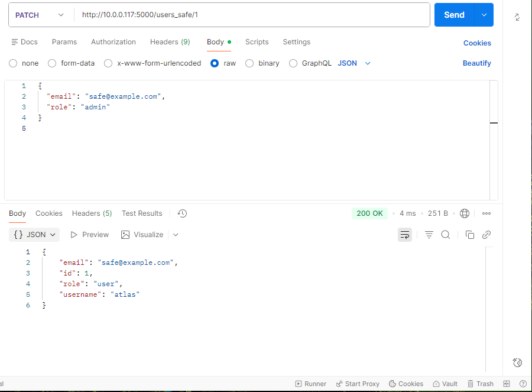
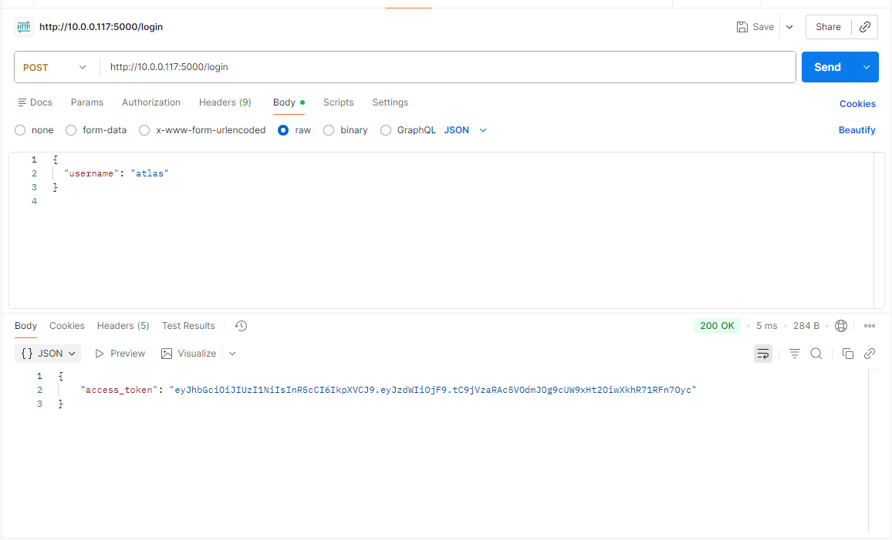
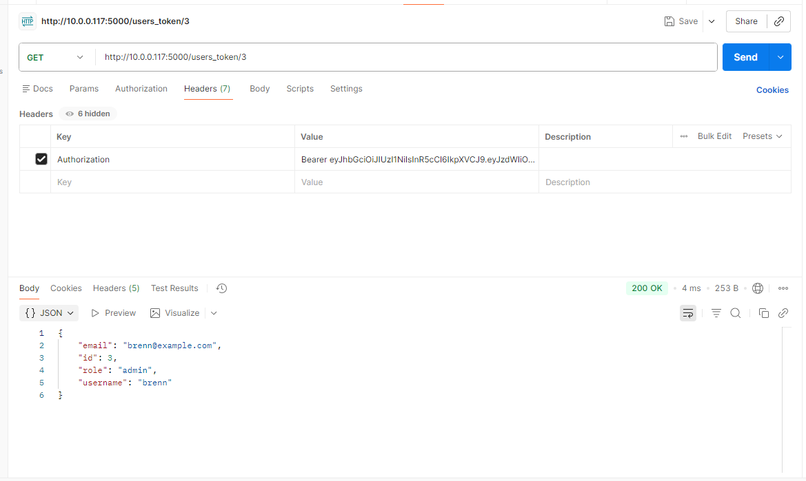
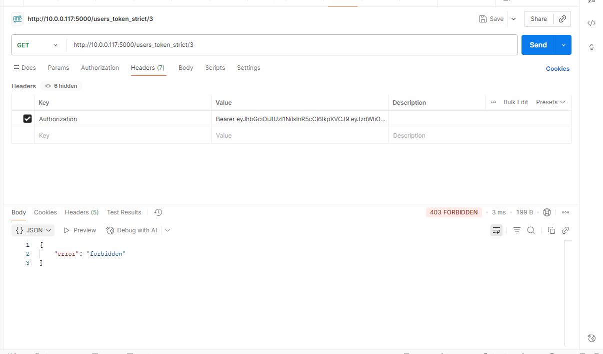
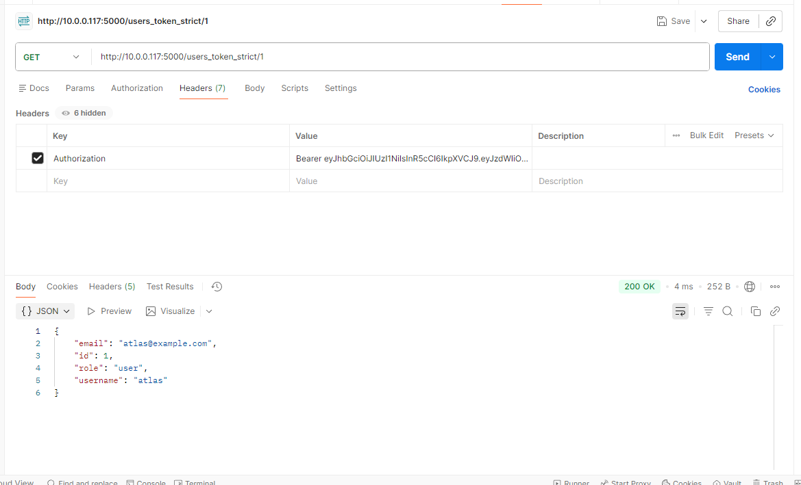

# SparringPartner v1 — Vulnerable API (Flask)

Deliberately vulnerable Flask API built to practice product and API security reasoning, with a focus on authorization correctness. Rather than cataloging vulnerabilities, this project is structured around exploit security claims, how those claims can fail, and how to fix them correctly at the server. 

Security Claims Demonstrated
---
Claim 1  - Object access is restricted to the owning user

	A user should only be able to read or modify their own user object

Claim 2 - Privileged attributes cannot be modified by clients

	Clients must not be able to escalate privileges or modify protected fields through request input

Claim 3 - Valid token presence does not imply authorization

	A valid token must still be bound to the object the user is accessing. 

Each claim is demonstrated with:

	- A vulnerable endpoint
	- A real exploit (via Burp/Postman)
	- A fixed comparison endpoint
	- Clear evidence of break > root cause > fix. 


## Tech Stack

- Python 3.14.2
- Flask
- In-memory "users" dictionary (no real DB)
- Tested locally on Windows

To run locally:

```bash
python -m venv venv
venv\Scripts\activate
pip install flask
python app.py
```

API listens on http://127.0.0.1:5000 (or host IP when bound to 0.0.0.0).

In-Memory Users
```users = {
    1: {"id": 1, "username": "atlas",  "role": "user",  "email": "atlas@example.com"},
    2: {"id": 2, "username": "dray",   "role": "user",  "email": "dray@example.com"},
    3: {"id": 3, "username": "brenn",  "role": "admin", "email": "brenn@example.com"},
}
```
User 3 (brenn) is the admin account used in the demos.

---

API Endpoints Overview

| Method | Endpoint                     | Purpose                                                        |
|--------|-------------------------------|----------------------------------------------------------------|
| GET    | /health                      | Simple liveness probe                                          |
| GET    | /users/<id>                  | **Vulnerable** - IDOR: returns user by ID with no auth         |
| GET    | /users_secure/<id>           | **Safe** - IDOR mitigated via identity binding                 |
| PATCH  | /users/<id>                  | **Vulnerable** - Mass Assignment (can escalate privileges)     |
| PATCH  | /users_safe/<id>             | **Safe** - Mass Assignment mitigated via whitelisted fields    |
| POST   | /login						| Issues demo JWT token											 |
| GET	 | /users_token/<id>			| **Vulnerable** - BOLA with valid token (no ownership binding)  |
| GET	 | /users_token_strict/<id>     | **Safe** - Token identitiy must match object ID				 |
  
---

Vulnerability 1 — IDOR / BOLA

Claim Violated
	- A user can only access their own user object.

Vulnerable Endpoint
	- GET /users/<id>

Code:
```@app.route("/users/<int:user_id>", methods=["GET"])
def get_user(user_id):
    user = users.get(user_id)
    if not user:
        return jsonify({"error": "not found"}), 404
    # VULNERABILITY: no authentication, no ownership check
    return jsonify(user), 200
```
---

Exploit Summary

Victim legitimately calls:
```
GET /users/1
```
Attacker intercepts this request in Burp (Proxy).

Attacker modifies the path:
```
/users/1 → /users/3
```
Server returns the admin user:
```
	{
  "id": 3,
  "username": "brenn",
  "role": "admin",
  "email": "brenn@example.com"
}
```
No AuthN or AuthZ (Just ID in the URL)

This demonstartes authorization derived from client-controlled input (URL)

---

Fixed Comparison Endpoint

GET /users_secure/<id>

Code:
```
@app.route("/users_secure/<int:user_id>")
def get_user_secure(user_id):
    user = users.get(user_id)
    if not user:
        return jsonify({"error": "not found"}), 404

    # Expect header: X-User-ID: <int>
    requester_id = request.headers.get("X-User-ID")

    try:
        requester_id = int(requester_id)
    except (TypeError, ValueError):
        return jsonify({"error": "forbidden"}), 403

    if requester_id != user_id:
        return jsonify({"error": "forbidden"}), 403

    return jsonify(user), 200
```
Used here to illustrate the core principle:

Authorization must be derived from server-side identity (here approximated by X-User-ID), not from the client-controlled ID in the URL.

---

Vulnerability 2 — Mass Assignment / Privilege Escalation

Claim Violated
	- Clients cannot modify privileged attributes

Vulnerable Endpoint
	- PATCH /users/<id>

Code:
```
@app.route("/users/<int:user_id>", methods=["PATCH"])
def update_user(user_id):
    user = users.get(user_id)
    if not user:
        return jsonify({"error": "not found"}), 404

    # VULNERABILITY: blindly apply all fields from JSON to the user object
    data = request.get_json() or {}
    user.update(data)

    return jsonify(user), 200
```
---

Exploit Summary 

 1)Normal user starts as:
 ```
	{
  "id": 1,
  "username": "atlas",
  "role": "user",
  "email": "atlas@example.com"
}
```
2)Attacker sends:
```
PATCH /users/1
Content-Type: application/json

{
  "role": "admin"
}
```
3)Server response:
```
	{
  "id": 1,
  "username": "atlas",
  "role": "admin",
  "email": "atlas@example.com"
}
```
4)Follow up GET /users/1 confirms role is now "admin" 

---

Fixed Comparison Endpoint

Safe endpoint
	PATCH /users_safe/<id>
	
Code:	
```
ALLOWED_UPDATE_FIELDS = {"email", "username"}

@app.route("/users_safe/<int:user_id>", methods=["PATCH"])
def update_user_safe(user_id):
    user = users.get(user_id)
    if not user:
        return jsonify({"error": "not found"}), 404

    data = request.get_json() or {}
    safe_data = {k: v for k, v in data.items() if k in ALLOWED_UPDATE_FIELDS}
    user.update(safe_data)

    return jsonify(user), 200
```
Example request:
```
PATCH /users_safe/1
Content-Type: application/json

{
  "email": "safe@example.com",
  "role": "admin"
}
```
Response:
```
{
  "id": 1,
  "username": "atlas",
  "role": "user",
  "email": "safe@example.com"
}
```
Email is updated (whitelisted) and role is ignored (protected) when supplied by the client. 

---

Vulnerability 3 - BOLA with a Valid Token

Claim Violated
	- Valid token presence does not imply authorization

This slice demonstrates that "valid token present" does not automatically mean "authorized for this object"
	- A token provides identity, but authorization must still enforce object ownership 

Login > Token(POST /login)

Request:
```
{
  "username": "atlas"
}
```

Reponse:
```
{
  "access_token": "<JWT with sub = 1>"
}
```
The token payload is effectively:
```
{ "sub": 1 }
```
'sub' is treated as the server-side identity for user 1 (Atlas)

Vulnerable Endpoint
	- GET /users_token/<id>

Code:
```
@app.route("/users_token/<int:user_id>", methods=["GET"])
@require_token
def get_user_token(user_id):
    user = users.get(user_id)
    if not user:
        return jsonify({"error": "not found"}), 404

    # VULNERABILITY: ignores request.current_user_id
    return jsonify(user), 200
```

Exploit Summary

Request - Token belongs to "atlas", but path requests user 3:
```
GET /users_token/3
Authorization: Bearer <atlas_token>
```
Reponse returns brenn(admin)

**Any valid token can ready any user - BOLA even with correct authentication**

The system is still deriving authorization from client-controlled path 

---
Fixed Comparison Endpoint

Safe endpoint
	- GET /users_token_strict/<id>

Code:
```
@app.route("/users_token_strict/<int:user_id>", methods=["GET"])
@require_token
def get_user_token_strict(user_id):
    current_user_id = getattr(request, "current_user_id", None)
    if current_user_id != user_id:
        return jsonify({"error": "forbidden"}), 403
    return jsonify(users[user_id]), 200
}
```
With the same "atlas" token (sub = 1):
	- GET /users_token_strict/3 > 403 forbidden
	- GET /users_token_strict/1 > returns atlas

**Correct behavior**
	- Authorization is enforced by comparing **token identity** (sub) to the object being access (<id>), not by trusting the URL
	

---

# Slice 3 — Dockerized Deployment & Trust Boundary Notes

This slice wraps the Flask API in a single Docker container to make the deployment context more realistic, without jumping into orchestration or Kubernetes.

## Dockerfile (simplified view)

- Base image: `python:3.11-slim`
- Copies `app.py` into `/app`
- Installs `flask` and `PyJWT`
- Exposes port `5000`
- Starts the app with `python app.py` (Flask bound to `0.0.0.0` inside the container)

Build:

```bash
docker build -t sparringpartner:dev .
```
Run:
```
docker run --rm -p 5000:5000 --name sparringpartner sparringpartner:dev
```
The API is then reachable at:
```
http://localhost:5000
```
## Trust Boundary — Before vs After Docker

### Before (bare process)

- Flask ran directly on the host (Windows), bound to `127.0.0.1` and/or a LAN IP like `10.x.x.x`.
- The trust boundary for network access was:
  - The OS network stack
  - Host firewall rules
  - Anything else on the same machine could potentially talk to the app

### After (single Docker container)

- The app runs as a process inside a container namespace
- Internally, Flask still binds to `0.0.0.0:5000` **inside the container**
- The host decides how (and whether) to expose that port via `-p` flags

The new trust boundary is:

> Anything that can reach the **published host port** can now reach the vulnerable API inside the container.

On a laptop with no inbound exposure, this is mostly local.  
On a cloud VM with a public IP and open firewall, the same command makes the lab API **internet-accessible**.

---

## Exposure Changes with `0.0.0.0` and Port Publishing

Inside the container, binding to `0.0.0.0` means:

> “Accept connections on any container interface.”

That only matters externally once a port is published:

- `-p 5000:5000` maps **host port 5000 → container port 5000**

If the host’s `0.0.0.0:5000` is reachable from the internet (cloud VM, insecure security group, etc.), then every intentionally vulnerable endpoint becomes externally reachable.

Key lesson:

> “Just a local learning API” becomes a real attack surface once the host is exposed.  
> Docker does not secure the API — it changes the **delivery context and exposure**.

---

## Realistic Failure Modes (Single-Container Level)

**1) Accidental internet exposure of a lab container**

- Developer runs this container on a cloud VM with:
  - `-p 5000:5000`
  - Public IP
  - Security group open to `0.0.0.0/0`
- The vulnerable API (IDOR, mass assignment, token BOLA) becomes public attack surface
- Assumption *“it’s just a local lab”* is false in that deployment context

**2) Misplaced trust in “container isolation”**

- Team assumes *“it’s in Docker so it’s isolated”*
- Another service on the same host (or same Docker network) can still reach:
  - `http://localhost:5000`
  - `http://sparringpartner:5000`
- Any SSRF or internal request from a more-privileged service can hit this API and exploit insecure endpoints

Practical takeaway:

> **Network reachability**, not “container vs bare metal,” determines who can attack the app.

---

This slice is intentionally limited to **single-container awareness**:

- No orchestration, Compose, or Kubernetes
- Focus = **exposure, port publishing, and trust-boundary shifts when an API is containerized**

---

# Slice 4 — Minimal AWS Deployment & Internet-Facing Claims

In this slice, SparringPartner is deployed as a Dockerized container on a single EC2 instance in AWS. The goal is not production DevOps — the goal is to make the API **genuinely internet-reachable** and reason about the security claims that context creates.

## Path: Client → Internet → AWS → EC2 → Docker → Flask

```

Client (Browser / Postman)
  ↓
Public Internet
  ↓
AWS (routing + public IP)
  ↓
EC2 instance (security group controls who can reach port 80)
  ↓
Docker (host 80 → container 5000)
  ↓
Flask app (vulnerable endpoints)
```
- EC2 exposes a public IPv4 address
- Security group allows inbound HTTP/80 from whitelisted IP adress (MyIP)
- Docker maps '80>5000'
  ```
  docker run -d -p 80:5000 sparringpartner:aws
  ```
- Flask still listens on '0.0.0.0:5000' inside the container

  Result:
  	- The same vulnerable API is now reachable from the internet, subject to cloud-level network controls

 ## Internet-Facing Security Claims (Falsifiable)

**Claim A — Only my IP can reach the API**

- Enforcement point: EC2 Security Group inbound rule on TCP/80 = *My IP only*
- What would falsify this claim:
  - Changing the rule to `0.0.0.0/0`
  - Adding another security group or load balancer that exposes the instance indirectly
  - Observing the API is reachable from a different network or device

**Claim B — The API is only reachable via port 80**

- Enforcement point: only TCP/80 is open (SSH 22 is restricted to My IP)
- What would falsify this claim:
  - Opening additional inbound ports (e.g., 5000, 8080)
  - Starting another container or process and exposing it
  - A scan from another host shows more listening services

**Claim C — Cloud deployment does not change application-layer risk**

- The same intentional vulnerabilities remain:
  - `/users/<id>` → IDOR / BOLA
  - `PATCH /users/<id>` → Mass assignment
  - `/users_token/<id>` → Token-based BOLA
- What would falsify misunderstanding:
  - Assuming “it’s in AWS so it’s protected”
  - Treating network controls as a substitute for authorization
  - Exposing the instance to the internet and seeing the same flaws remain exploitable
 
---

# Slice 5 — Reverse Proxy & Header-Based Trust (nginx)

This slice adds an nginx reverse proxy in front of the Flask app and shows how **header-based identity** only makes sense if the backend enforces the proxy as a real trust boundary.

The key point:

- Through nginx, the client **cannot** spoof `X-User-ID` (nginx overwrites it).
- If the backend is reachable directly, a client **can** spoof `X-User-ID` unless the backend enforces a proxy-only signal.

## Architecture

```text
Client (curl / Postman)
  ↓
EC2 public IP (port 80)
  ↓
nginx (reverse proxy)
  ↓  (adds X-User-ID and X-From-Proxy)
app:5000 (Flask)
```
nginx config:
```
upstream app_upstream {
    server app:5000;
}

server {
    listen 80;

    location / {
        proxy_pass http://app_upstream;

        proxy_set_header X-User-ID    "1";                              # identity set by proxy
        proxy_set_header X-From-Proxy "sparringpartner-proxy-secret";   # proxy-only marker
    }
}
```
*Important*: `proxy_set_header X-User_ID "1";` means nginx overwrites any X-User_ID sent by the client. The backend never sees the client's original value when traffic goes through nginx.

**Endpoints**

- Two endpoints are added for this slice:
	- `GET /users_proxy/<id>`        # vulnerable: trusts X-User-ID as identity
	- `GET /users_proxy_safe/<id>`   # "safe": only trusts X-User-ID if proxy marker is present

**Vulnerable pattern - header as identity, no boundary enforcement**

	`users_proxy/<id>`:
			- Reads `X-User-ID` and treats it as the caller's identity
			- Returns user ID if `X-User-ID == id`
			- Does not enforce that the header came fvrom nginx

	Through nginx (port 80)	
	``
	curl http://localhost/users_proxy/1
	# nginx sends X-User-ID: 1 and X-From-Proxy: sparringpartner-proxy-secret
	# backend returns atlas (id 1)
``
Spoofing from the client via nginx does not work:
	```
	# X-User-ID: 3 from the client is overwritten by nginx back to 1
	GET http://<EC2_PUBLIC_IP>/users_proxy/3
```
Backend still sees `X-User-ID` as 1, so /users_proxy/3 returns 403.

**X-User_ID cannot be spoofed through the proxy - nginx owns that header**

The vulnerability appears when the backend is reachable directly

On the EC2 instance (bypass nginx)
```
	curl -H "X-User-ID: 1" http://localhost:5000/users_proxy/1
	# direct to Flask; backend trusts whatever X-User-ID the client sends
	```
This models:
	- We trust X-User_ID because the proxy sets it - but the backend is also reachable without the proxy

Fixed pattern — require a proxy-only signal

`/users_proxy_safe/<id>`:

Still uses `X-User-ID` as identity.

Only trusts it if a proxy-only marker is present and correct:
```
proxy_marker = request.headers.get("X-From-Proxy")
if proxy_marker != PROXY_SHARED_SECRET:
    return jsonify({"error": "forbidden"}), 403
```
Through nginx (port 80):
```
curl http://localhost/users_proxy_safe/1
# nginx adds:
#   X-User-ID: 1
#   X-From-Proxy: sparringpartner-proxy-secret
# backend returns atlas
```
Directly to Flask on 5000 (no proxy secret)
```
curl -H "X-User-ID: 1" http://localhost:5000/users_proxy_safe/1
# no X-From-Proxy -> 403 {"error":"forbidden"}
```
Rule encoded:
	- ***Headers are only identity if there is evidence they came from the trusted proxy***
	
In a real system this would be combined with:
	- backend not publicly reachable, or
	- IP / network allowlist, or
	- mTLS between proxy and app

This slice isolates the core idea:
	- Reverse proxy = trust boundary.
	- Headers are not identity unless that boundary is enforced.
***Commands Summary***
App container on 5000:
```
sudo docker run -d --name app --network sp_net -p 5000:5000 sparringpartner:aws
```
nginx fronting the app on 80:
```
sudo docker run -d \
  --name sparringpartner_nginx \
  --network sp_net \
  -p 80:80 \
  -v $HOME/sparringpartner/nginx.conf:/etc/nginx/nginx.conf:ro \
  nginx:alpine
```
***EC2 tests (proxy vs direct)***
Through nginx (port 80)
```
curl http://localhost/health
curl http://localhost/users_proxy/1
curl http://localhost/users_proxy_safe/1
```
Direct to Flask (port 5000)
```
curl http://localhost:5000/health
curl -H "X-User-ID: 1" http://localhost:5000/users_proxy/1        # succeeds (vulnerable)
curl -H "X-User-ID: 1" http://localhost:5000/users_proxy_safe/1   # 403 (safe, no proxy marker)
```
From machine (internet path)
```
http://<EC2_PUBLIC_IP>/health
http://<EC2_PUBLIC_IP>/users_proxy/1
http://<EC2_PUBLIC_IP>/users_proxy_safe/1

#IP changes when started in EC2
```
All external trafiic hits nginx on port 80
Header spoofing and bypass tests happen ***inside the instance on port 5000***

---
Tooling Used

Burp Suite Community
	- Proxy: ID tampering
	- Repeater: replaying object-level access attempt

Postman
	- Mass assignment testing
	- Token issuance and token BOLA demonstration


---


Key Takeaways

IDOR/BOLA: Do not derive authorization from client-controlled IDs (URL/path/body). Bind access control to server-side identity.

Token BOLA: A valid token does not imply authorization - identity must still be bount to the object 

Mass Assignment: Never blindly apply client JSON to server objects. Use explicit whitelists for mutable fields and protect privileged attributes.

**Authorization must always be enforced server-side, based on trusted identity and policy.** 


---

## Screenshots (Proof of Exploitation)

### IDOR (Insecure Direct Object Reference)

**1) Intercepting legitimate request**

<span>

</span>

**2) Mutating user ID to access admin**
<span>

</span>

**3) Unauthorized admin data returned**
<span>

</span>

---

### Mass Assignment (Privilege Escalation)

**1) Privilege escalation via role change**
<span>

</span>

**2) Verification: GET confirms admin role**
<span>

</span>

**3) Safe endpoint blocks role change (whitelist)**
<span>

</span>

---

### Token BOLA

**1) Token Issuance**

<span>

</span>

**2) Vulnerable token BOLA**

<span>

</span>

**3) Strict endpoint blocking cross-user access**

<span>

</span>
<span>

</span>


